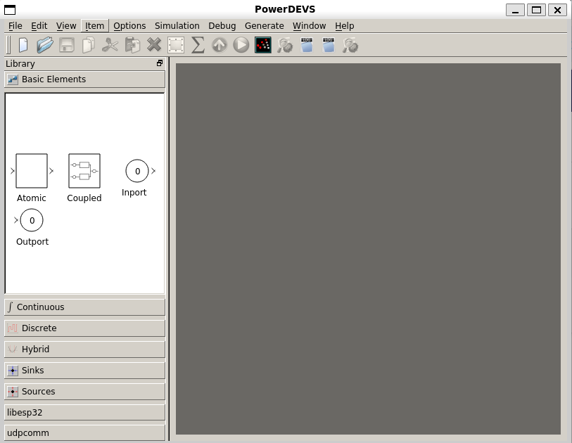
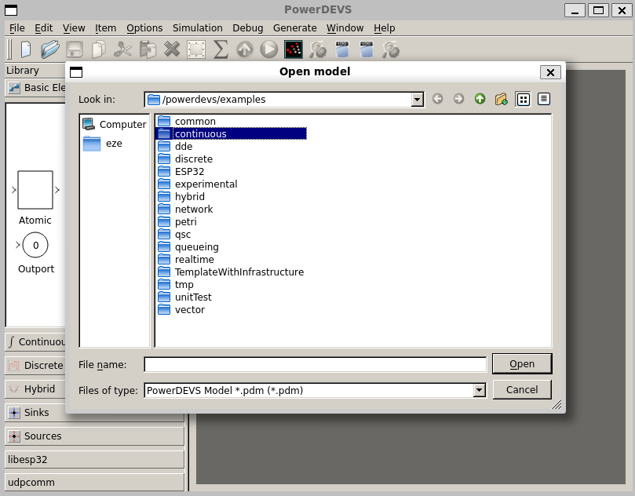
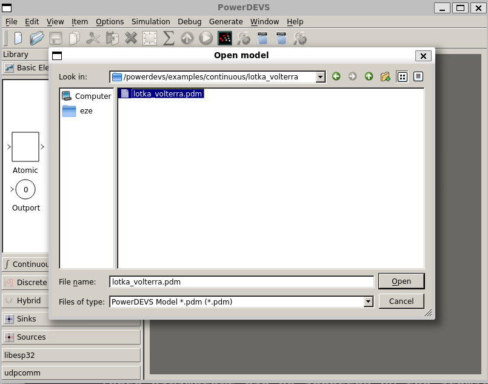
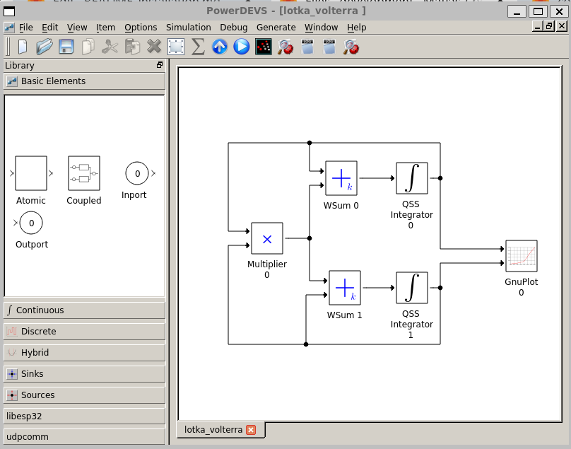
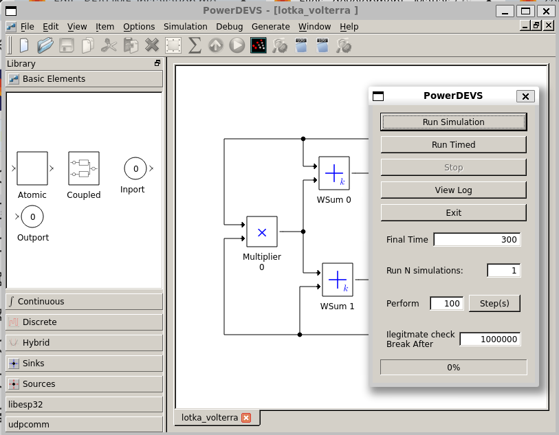
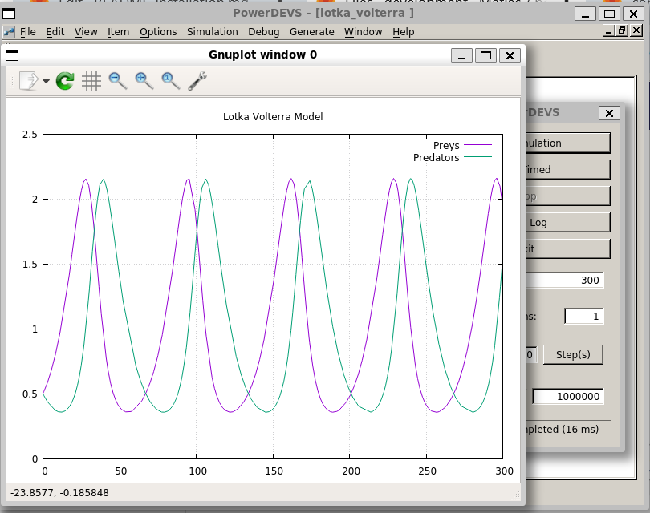

# PowerDEVS installation on Ubuntu/Debian

## Verified Operating Systems
PowerDEVS 3.0 was tested on the following operating systems:
|Host OS|Status|Observations|
|-------|------|------------|
|Ubuntu 16.04|OK||
|Ubuntu 18.04|OK||
|Debian 9|OK||
|Debian 10|OK||
|CentOS7|OK||

## Installing PowerDEVS Dependencies (CERN Version)

To install PowerDEVS on the host operating system, the following dependencies are required:

|Dependency|Version|
|----------|-------|
|Qt        |   4   |
|Scilab	   |5.5.2  |
|Python	   |2.7    |

Start by navigating to the user's home directory `/home/user/` and clone the powerdevs gitlab repository:

```bash
git -c http.sslVerify=false clone git@git-modsimu.exp.dc.uba.ar:matiasb/powerdevs-CERN.git powerdevs
```

You will also need `g++` version > 4.8. To check your current version of `g++`, run:
```bash
g++ -v
```

Now, install all required dependencies (assuming you are using Ubuntu/Debian, otherwise replace `apt` by the corresponding package manager):

* Install build-essential:
```bash
sudo apt install build-essential
```

* Install the Qt4 library for the graphical interface:
```bash
sudo apt install qt4-qmake qt4-qtconfig qt4-dev-tools
```

* Install the Boost library:
```bash
sudo apt install libboost-all-dev
```

* Install the GSL (GNU Scientific Library):
```bash
sudo apt install libgsl-dev
```

* Install the HDF5 libraries:
```bash
sudo apt install hdf5-tools h5utils libhdf5-dev
sudo apt install python-h5py
```

* Install GNUPlot:
```bash
sudo apt install gnuplot
```

* Install the applications valgrind, kcachegrind, and graphviz for profiling (not mandatory):
```bash
sudo apt install valgrind kcachegrind graphviz
```

* Install Python development libraries:
```bash
sudo apt install libpython-all-dev
```

## Build PowerDEVS
Build PowerDEVS inside the container:
```bash
make clean && make -j X
```
* *Note*: Replace *X* with as many physical cores your build system has.
  * If using a modern CPU, only count the P cores

Compiling Py2PowerDEVS requires significant RAM and time. Unless strictly necessary, this step can be skipped by using:
```bash
make -py2powerdevs
```

## Verifying the PowerDEVS Installation
Once the compilation is complete, we need to verify that PowerDEVS was installed correctly. To do this, we’ll run the Lotka-Volterra model.

You can run a model either using the PowerDEVS GUI or from the terminal.

### Running the Model Using the GUI

1. Go to repository folder and open the Model Editor or PowerDEVS GUI (`pdme`):
```bash
cd powerdevs
bin/pdme &
```
or replace the last line by: 
```bash
./runPD
```

It should open the PowerDEVS Model Editor window:



2. Run DEVS models from GUI:
    * **Lotka-Volterra Model**
        - Click menu **Open**. Next window should appear:
          

        - Navigate in folder **continuous** and open **Lotka-Volterra** model:
          

        - Next model should appear:
        
        

        - Click **Run** button or press F5 key. A new window with the simulation interface should be opened:
          

        - Click **Run Simulation** button. The result of the simulation should appear in a new GNUPlot window.
          

### Running the Model from the Command Line

Open a terminal and set the PowerDEVS root directory as your working directory:
```bash
cd ~/powerdevs/
```

Test the Lotka-Volterra model built with the GUI (`pdm` file). Compile the Lotka-Volterra model to create the file `model.h`:
```bash
bin/pdppt -m examples/continuous/lotka_volterra/lotka_volterra.pdm
```

Then, move to `build/` and build the model:
```bash
cd build
make
```

This step should create an executable file named `model` in `output/` ready to use. To run it, use the following commands:
```bash
cd ../output
./model -tf 300
```

Options:
  - `--help`: prints the help message.
  - `-tf`: specifies the simulation's final time.

For more examples executed from the CLI please check the bash script [runTests.sh](runTests.sh).

## Known Issues

**Problem** 
Both Qt4 and Qt5 libraries are installed, and Qt-related errors occur during compilation.

**Solution** 
PowerDEVS uses Qt4, and several Makefiles are automatically generated using the Qt4 qmake command. If qmake from Qt5 is used instead, the function paths will point to Qt5, and there are differences in function names and data types between Qt4 and Qt5.

To ensure that the build process uses the Qt4 qmake, add the `-qt=qt4` option to the Makefile in the root directory. For example:

```bash
pdppt:
    cd ./src/pdppt && qmake -qt=qt4 CONFIG+=$(MODE)
    make -C ./src/pdppt MODE=$(MODE)
```
