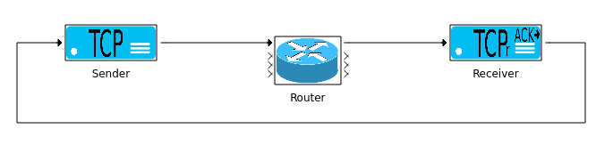

# Basic Network Example



For a full step-by-step guide check [here](https://twiki.cern.ch/twiki/bin/view/Main/PowerDEVSBasicNetworkExample)

To run the compiled model (`network_basic.pdm`): 
```bash
bin/pdppt -m examples/network/basic/network_basic.pdm
cd build
make
cd ../output/
./model -tf 30 -c ../examples/network/basic/network_basic.params -finalization_script ../examples/network/basic/finalization.py
```

To run the Py2PowerDEVS model under `py2pdevs/`:
```bash
cd examples/network/basic/py2pdevs/
python network_basic.py -tf 30
```
