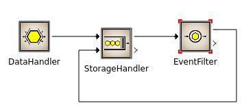

# Queueing Model



## Run the model through the GUI

## Run the model through the command line

1. Go to the root folder and run the preprocessor to generate `model.h`:
```bash
cd powerdevs/
bin/pdppt -m examples/queueing/basic.pdm
```

2. Then compile the model (make sure that there is no `model` executable in the `output` folder:
```bash
cd build
rm ../output/model
make
```
the folloging line will be run:
```bash
g++ -Wall  -DO_BINARY=0  -std=c++11 -fPIC  -I../src -I../src/engine/common -I../atomics -I../src/utils -Iinclude -I. -I/usr/include/python2.7/  ../src/model/model.cpp -Llib -lengine -lmodels -lutils -lhdf5 -lboost_program_options -lboost_system -lboost_python -lpython2.7 -lgsl -lgslcblas -Wl,-rpath=/powerdevs/build/lib  -o ../output/model
```

3. Finally, run the model specifying the final simulation time (in this case 30s):
```bash
cd ../output/
./model -tf 10 -c ../examples/queueing/basic.params --parameter_reading_backend CmdLine --variable_logging_backend hdf5
```

4. Additionally, to plot the results logged in the file `basic_0.h5` run:
```bash
python3 ../examples/queueing/plot.py
```


## Run the model with Py2PowerDEVS

1. Run the model specifying the final simulation time (in this case 30s):
```bash
cd powerdevs/examples/queueing/
python basic.py -tf 10 --variable_logging_backend hdf5
```

4. Additionally, to plot the results logged in the file `basic_0.h5` run:
```bash
python3 plot.py
```

