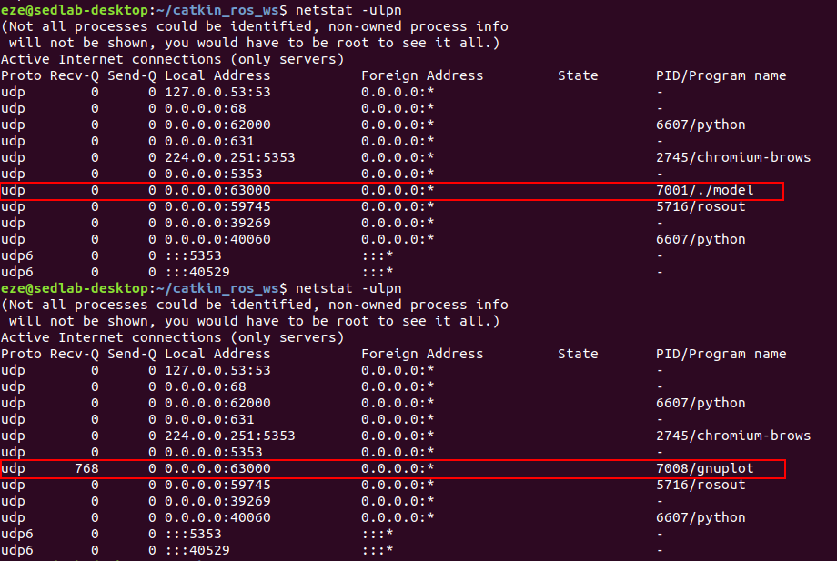
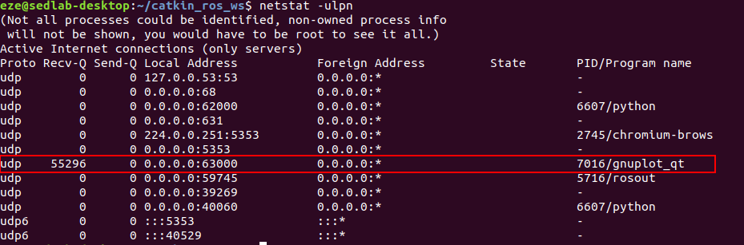

# Changes in the engine of PowerDEVS

To make a PowerDEVS model able to communicate with an external tool via UDP we need to perform some changes in the PowerDEVS engine. 

In a nutshell: 
* An incomming UDP message is put in a message queue, 
* An atomic that is waiting for UDP messages in a given port is registered in a listerner list, 
* An independient thread is declared for every atomic listener (there exist N threads listening concurrently, however all of the write in a common message queue), and remains listening in the corresponding UDP port, 
* As soon as there is an available UDP message it is sent to the corresponding atomic as a external event. 
* When an atomic model wants to send an UDP messages it is sent this to the corresponding UDP port with no delay (no queues).

The class simulator had to be modified in `simulator.cpp` and `simulator.h` to accept incoming UDP messages as external events in the DEVS viewpoint.

Most changes are in made in `src/engine/linux/pdevslib.linux.cpp`. Some of the C++ function incorporated are listed below:
* `sendNET()`: Every time it receives a new data message it opens an UDP port, sent the message and closes the port.
* `RequestNET()`: It's used by every DEVS atomic registered as a listener. In case, it is't already registered a new thread is launched running the function `net_handler()` which listens to the port passed as an argument in a while(True) loop. Every incoming message is enqueued in netQueue.
* `initNet()`: This function is twofold: on the one hand it creates the queue of messages `MsgQueuey`, on the second hand it creates the list of listeners.
* `endnet()`: Currently it does nothing.
* `waitFor()`: This function is extended so that during the waiting times (whe it's no busy) dequeue messages and send them to their corresponding atomics. To alert an atomic of a incoming message it's used the function `alertOfNET()`.

Finally, the files `queue.hpp` and `portListeners.hpp` includede all the definitions of the classes for the message queue and the listeners.

## PowerDEVS atomic models for UDP communication

* `readudp`: Receives a string message with the float value sent from ROS.
* `sendudp`: Sends a string message with the float value received by the input port.

## Test UDP communication through CLI

To test the UDP communication with a PowerDEVS model using DOVER we will take advantage of the netcat (nc) command.

In Terminal 1 type the following:
```bash
$ cd output/
$ ../bin/pdppt -m ../examples/udpcomm/test-udp.pdm
$ ./model -tf 10 --rt
```

In Terminal 2 type the following to listen to the sinousoidal signal that is being sampled and sent by PowerDEVS:
```bash
nc -ul -p 62000
```

In Terminal 3 execute the following command to send float number after pressing enter:
```bash
nc -u 127.0.0.1 63000
```

## Test UDP communication with Python

### Sample scipts:

We'll use the scripts `clientUDP-PD.py` and `serverUDP-PD.py` placed in `examples/DOVER/test-python/`.

In terminal 1:
```bash
$ python clientUDP-PD.py "127.0.0.1" "63000"
```

In terminal 2:
```bash
python serverUDP-PD.py "62000"
```

# Known issues

After executing PowerDEVS the UDP port for reading still continuous blocked when using Ubuntu. This can be checked with the command `netstat -ulpn`. Therefore, before launching another run of PowerDEVS the process holding the UDP port must be killed (its corresponding PID is returned by netstat).

In the following figure it can be seen that once the PowerDEVS executable finish running the UDP port 63000 is taken by a process `gnuplot`:

<center>

</center>

Then, after killing powerdevs another process takes the UDP port:

<center>

</center>

It was not until the user kill all three processes that the UDP port 63000 is free and the simulation can already be launched.

